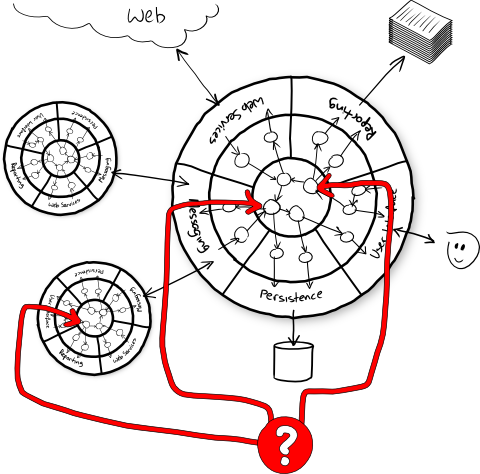
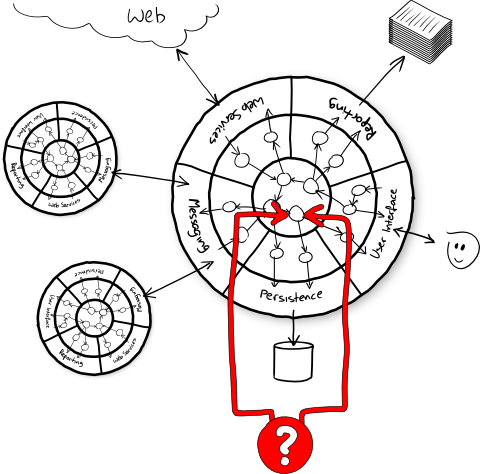
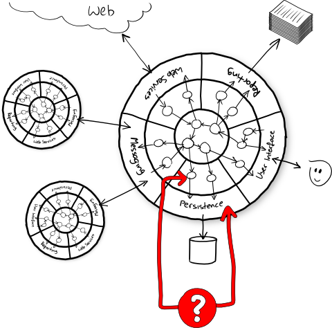
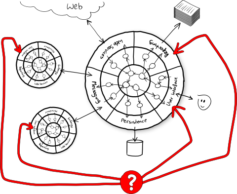
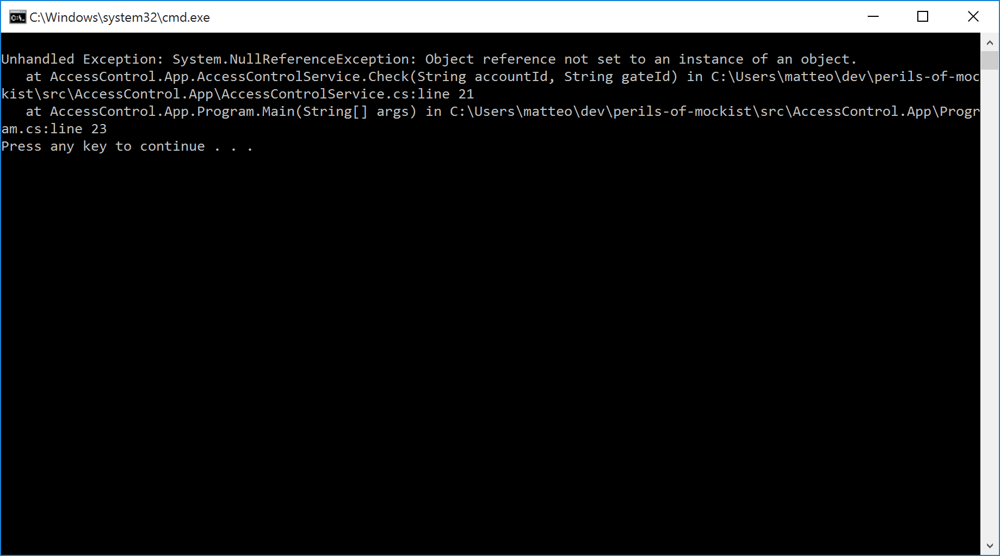

# the @color[IndianRed](perils)
# of @color[GoldenRod](mockist)

---
# Who am I?


<br /><br />
- declared @color[GoldenRod](developer) ;-)
- enthusiastic technical @color[GoldenRod](trainer/coach)
- wannabe @color[GoldenRod](entrepreneur)

---
## How many of you use mocks and mock library?

---
## How many of you have a satisfing suite of system tests?

---
# Disclaimer

---
## the talk isn't yet another classic vs mockist war

---
## ... and  does not want to demonize mock objects

---
# Relax

---
## My goal is to pinpoint to a problem I see around and how I handle it

---
## It's an opinionated solution
## Some of you might disagree

---
# Sync Testing
# Vocabulary

---
## Architecture


---
## Unit Testing


---
## Acceptance Testing


---
## Integration Testing


---
## System Testing


---
# Sync TDD
# Vocabulary

---
## Test-Driven
## Development

---
## Mock in a classic view

---
## Popularized by XP Explained and TDD by Example books

---
## Mockist TDD

---
## Need-Driven
## Design

---
## Impose an outside-in approch

---
## Impose an additional testing lib

---
## Popularized by GOOS book

---
# Example

### Access Control System

---
## Use cases:
- can access
- cannot acces
    - not valid badge
    - unknown badge

---
## First account allowed
```csharp
[Fact]
public void AccountAllowed()
{
    var accountRepository = new Mock<IAccountRepository>();
    var display = new Mock<IDisplay>();
    var accessControl = new AccessControlService(
                                accountRepository.Object,
                                display.Object);

    accountRepository
        .Setup(x => x.Load("23"))
        .Returns(new Account("23", "john", new[] { "42-B" }));

    accessControl.Check("23", "42-B");

    display.Verify(x => x.ShowWelcomeMessage("john"));
}
```

---
## Then account denied
```csharp
[Fact]
public void AccountDenied()
{
    var accountRepository = new Mock<IAccountRepository>();
    var display = new Mock<IDisplay>();
    var accessControl = new AccessControlService(
                                accountRepository.Object,
                                display.Object);

    accountRepository
        .Setup(x => x.Load("23"))
        .Returns(new Account("23", "john", new[] { "42-B" }));

    accessControl.Check("23", "NOT-MY-GATE");

    display.Verify(x => x.ShowUnauthroizedAccess("john"));
}
```

---
## And the unknown account
```csharp
[Fact]
public void UnknownAccount()
{
    var accountRepository = new Mock<IAccountRepository>();
    var display = new Mock<IDisplay>();
    var accessControl = new AccessControlService(
                                accountRepository.Object,
                                display.Object);

    accountRepository
        .Setup(x => x.Load(It.IsAny<String>()))
        .Throws<UnknownAccountException>();

    accessControl.Check("DOES-NOT-EXIST", "42-B");

    display.Verify(x => x.ShowUnknownAccount());
}
```

---
## Implementation
```csharp
public void Check(String accountId, String gateId)
{
    try
    {
        var account = accountRepository.Load(accountId);
        if (account.CanAccess(gateId))
            display.ShowWelcomeMessage(account.Name);
        else
            display.ShowUnauthorizedAccess(account.Name);
    }
    catch (UnknownAccountException)
    {
        display.ShowUnknownAccount();
    }
}
```

---
## Repository integration tests
```csharp
public class FlatFileAccountRepositoryTests
{
    [Fact]
    public void Found()
    {
        var fileName = PrepareFileWith(
            "23, john, 23-B|47-H",
            "64, mary, 55-B|31-H|67-A"
        );
        var repo = new FlatFileAccountRepository(fileName);

        var account = repo.Load("23");
        
        Assert.Equal("john", account.Name);
    }

    [Fact]
    public void NotFound()
    {
        var fileName = PrepareFileWith(
            "23, john, 23-B|47-H",
            "64, mary, 55-B|31-H|67-A"
        );
        var repo = new FlatFileAccountRepository(fileName);

        Assert.Throws<UnknownAccountException>(() => repo.Load("NOT-23"));
    }

    [Fact]
    public void MissingFile()
    {
        var fileName = RandomName();
        var repo = new FlatFileAccountRepository(fileName);

        Assert.Null(repo.Load("23"));
    }

    // ...private utils
}
```

---
## Display integration tests
```csharp
public class ConsoleDisplayTests
{
    [Fact]
    public void WelcomeMessage()
    {
        var writer = new StringWriter();
        var display = new ConsoleDisplay(writer);

        display.ShowWelcomeMessage("john");

        Assert.Equal("Welcome john!" + 
            Environment.NewLine, writer.ToString());
    }

    [Fact]
    public void UnauthorizedMessage()
    {
        var writer = new StringWriter();
        var display = new ConsoleDisplay(writer);

        display.ShowUnauthorizedAccess("john");

        Assert.Equal("Access denied john!" +
            Environment.NewLine, writer.ToString());
    }

    [Fact]
    public void UnknownMessage()
    {
        var writer = new StringWriter();
        var display = new ConsoleDisplay(writer);

        display.ShowUnknownAccount();

        Assert.Equal("Sorry, we don't know you." +
            Environment.NewLine, writer.ToString());
    }
}
```

---
## All tests
## are green


---
## Program main
```csharp
static void Main(string[] args)
{
    var fileName = "accounts.txt";
    Touch(fileName);

    var repository = new FlatFileAccountRepository(fileName);
    var display = new ConsoleDisplay(Console.Out);
    var service = new AccessControlService(repository, display);

    service.Check("some-account-id", "some-gate-id");
}
```

---
## The app goes
## into production

---
## We celebrate
## another victory

---
## new cool
## projects arrive

---
## Time goes on

---
## but in the end 
## it happens

---
## always

---
## new requirement

---
### we need to integrate
### with an awesome 
### backend exposed via TCP

---
## Tcp integration test
```csharp
public class TcpAccountRepositoryTests
{
    [Fact]
    public void Found()
    {
        var (address, port) = PrepareTcpServer(
            "23, john, 23-B|47-H",
            "64, mary, 55-B|31-H|67-A"
        );
        var repo = new TcpAccountRepository(address, port);

        var account = repo.Load("23");

        Assert.Equal("john", account.Name);
    }

    [Fact]
    public void NotFound()
    {
        var (address, port) = PrepareTcpServer(
            "23, john, 23-B|47-H",
            "64, mary, 55-B|31-H|67-A"
        );
        var repo = new TcpAccountRepository(address, port);

        Assert.Null(repo.Load("NOT-23"));
    }

    // ...private utils
}
```

---
## All tests 
## are green


---
## Different main
```csharp
static void Main(string[] args)
{
    var (address, port) = PrepareTcpServer(
        "23, john, 23-B|47-H",
        "64, mary, 55-B|31-H|67-A"
    );

    var repository = new TcpAccountRepository(address, port);
    var display = new ConsoleDisplay(Console.Out);
    var service = new AccessControlService(repository, display);

    service.Check("some-account-id", "some-gate-id");
}
```

---
## The app goes
## into production

---
## We celebrate
## another victory

---
## Customer report a bug

---
## The infamous Null


---
## tests with mocks are so isolated
## that they do not offer feedback 
## on the whole, at all

--- 
## tests with mocks aren't
## a regression suite

---
## Issues
1. LSP violation between repos
2. no feedback on Null

---
## Fix LSP violation

---
## Contract Tests

---
## Extract Arrange (FlatFile)
```csharp
public class FlatFileAccountRepositoryTests
{
    private IAccountRepository CreateWith(String id, String name)
    {
        var fileName = PrepareFileWith(
            $"{id}, {name}, 23-B|47-H",
            "64, mary, 55-B|31-H|67-A"
        );
    
        return new FlatFileAccountRepository(fileName);
    }
    
    [Fact]
    public void Found()
    {
        var repo = CreateWith("23", "john");
    
        var account = repo.Load("23");
    
        Assert.Equal("john", account.Name);
    }

    //...more tests
}
```

---
## Extract Arrange (Tcp)
```csharp
public class TcpAccountRepositoryTests
{
    private IAccountRepository CreateWith(String id, String name)
    {
        var (address, port) = PrepareTcpServer(
            $"{id}, {name}, 23-B|47-H",
            "64, mary, 55-B|31-H|67-A"
        );

        return new TcpAccountRepository(address, port);
    }

    [Fact]
    public void Found()
    {
        var repo = CreateWith("23", "john");
    
        var account = repo.Load("23");
    
        Assert.Equal("john", account.Name);
    }

    //...more tests
}
```

---
## Push Members Up
```csharp
public abstract class AccountRepositoryContractTests
{
    protected abstract IAccountRepository CreateWith(String id, String name);

    [Fact]
    public void Found()
    {
        var repo = CreateWith("23", "john");

        var account = repo.Load("23");

        Assert.Equal("john", account.Name);
    }
}
```

---
## Same as before
```csharp
public abstract class AccountRepositoryContractTests
{
    // ...more tests

    protected abstract IAccountRepository CreateWithout(String id, String name);

    [Fact]
    public void NotFound()
    {
        var repo = CreateWithout("23", "john");

        Assert.Null(repo.Load("23"));
    }
}
```

---
## Now one is red


---
## Align FlatFile to Tcp
## Repository behaviour

---
## All tests 
## are green


---
## But the Null is still there


---
## Fix no feedback on Null


---
# @color[GoldenRod](Thanks)