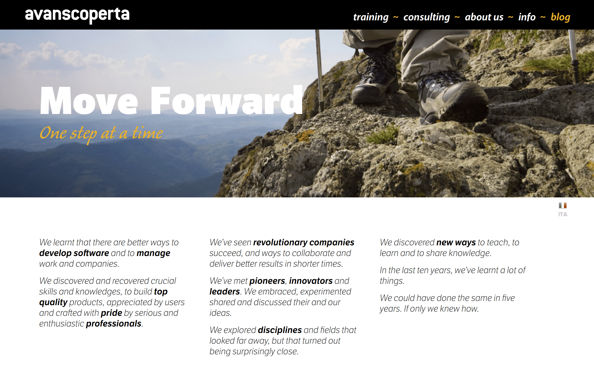
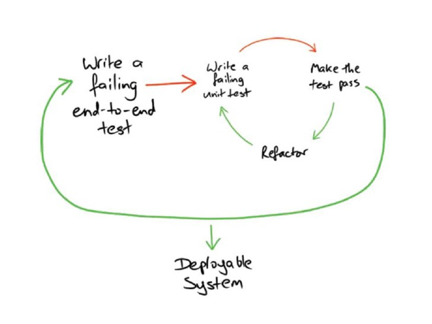
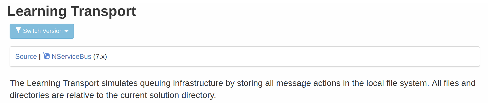
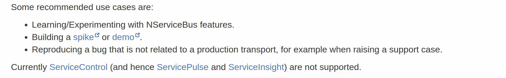
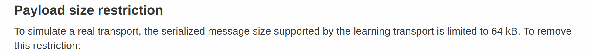
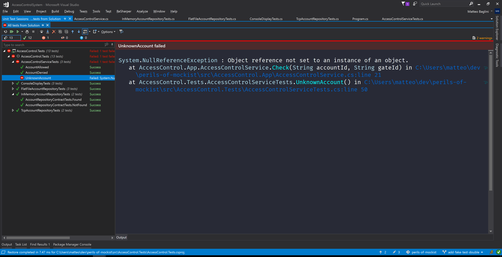

# the @color[IndianRed](perils)
# of @color[GoldenRod](mockist)

---
# Who am I?
- Hi, I'm Matteo!
- Came from Italy -> Tuscany -> Leghorn
- Declared @color[GoldenRod](developer) ;-)
- Enthusiastic technical @color[GoldenRod](trainer/coach)
- Wannabe @color[GoldenRod](entrepreneur)

---
# Co-found


---
# Collaborate with


---
# How many of you ... ? 

---
# @color[GoldenRod](Disclaimer)

---
## @color[GoldenRod](1.) not about 
## classicist vs mockist

---
## @color[GoldenRod](2.) does not want to demonize mock objects

---
## My goal is to pinpoint 
## to a problem I see around 

--- 
## Show my 
## opinionated solution

---
## Some of you might disagree
## No problem, It's ok! :-)

---
# Relax, have @color[GoldenRod](fun)

---
# Sync @color[IndianRed](Testing)
# Vocabulary

---
## Architecture


---
## Unit Testing


---
## Acceptance Testing


---
## Integration Testing


---
## System Testing


---
# Sync @color[IndianRed](TDD)
# Vocabulary

---
## Classicist TDD

---
## A Mock is a replace for 
## hard to test resource

---
## Popularized by @color[GoldenRod](XP Explained)
## and @color[IndianRed](TDD by Example) books

---
## Mockist TDD

---
## Need-Driven Design

### Design provider interface
### from the consumer point of view

---
## Require an 
## outside-in approch

---
## Benefit from the use of 
## a mocking library

---
## Popularized by @color[GoldenRod](GOOS) book

---
# Today Example

### Access Control System

---
## Use cases:
- account can access
- account cannot acces
    - unauthorized
    - unknown

---
## First account allowed
```csharp
[Fact]
public void AccountAllowed()
{
  var accountRepository = new Mock<IAccountRepository>();
  var display = new Mock<IDisplay>();
  var accessControl = new AccessControlService(
                              accountRepository.Object,
                              display.Object);

  accountRepository
    .Setup(x => x.Load("23"))
    .Returns(new Account("23", "john", new[] { "42-B" }));

  accessControl.Check("23", "42-B");

  display.Verify(x => x.ShowWelcomeMessage("john"));
}
```
@[4-5](collaborators)
@[6-8](object under test)
@[9-12](mock setup)
@[14](act)
@[16](mock expectation)

---
## Then account denied
```csharp
[Fact]
public void AccountDenied()
{
  var accountRepository = new Mock<IAccountRepository>();
  var display = new Mock<IDisplay>();
  var accessControl = new AccessControlService(
                              accountRepository.Object,
                              display.Object);

  accountRepository
    .Setup(x => x.Load("23"))
    .Returns(new Account("23", "john", new[] { "42-B" }));

  accessControl.Check("23", "NOT-MY-GATE");

  display.Verify(x => x.ShowUnauthroizedAccess("john"));
}
```
@[14](different act)
@[16](different mock expectation)

---
## And the unknown account
```csharp
[Fact]
public void UnknownAccount()
{
  var accountRepository = new Mock<IAccountRepository>();
  var display = new Mock<IDisplay>();
  var accessControl = new AccessControlService(
                              accountRepository.Object,
                              display.Object);

  accountRepository
    .Setup(x => x.Load(It.IsAny<String>()))
    .Throws<UnknownAccountException>();

  accessControl.Check("DOES-NOT-EXIST", "42-B");

  display.Verify(x => x.ShowUnknownAccount());
}
```

---
## Implementation
```csharp
public void Check(String accountId, String gateId)
{
  try
  {
    var account = accountRepository.Load(accountId);
    if (account.CanAccess(gateId))
      display.ShowWelcomeMessage(account.Name);
    else
      display.ShowUnauthorizedAccess(account.Name);
  }
  catch (UnknownAccountException)
  {
    display.ShowUnknownAccount();
  }
}
```

---
## Repo integration tests
```csharp
public class FlatFileAccountRepositoryTests
{
  [Fact]
  public void Found()
  {
    var fileName = PrepareFileWith(
        "23, john, 23-B|47-H",
        "64, mary, 55-B|31-H|67-A");
    var repo = new FlatFileAccountRepository(fileName);

    var account = repo.Load("23");
    
    Assert.Equal("john", account.Name);
  }

  [Fact]
  public void NotFound()
  {
    var fileName = PrepareFileWith(
        "23, john, 23-B|47-H",
        "64, mary, 55-B|31-H|67-A");
    var repo = new FlatFileAccountRepository(fileName);

    Assert.Throws<UnknownAccountException>(
      () => repo.Load("NOT-23"));
  }

  // ... other tests and private utils
}
```
@[3-14](account found)
@[16-26](account not found)

---
## Display integration tests
```csharp
public class ConsoleDisplayTests
{
  [Fact]
  public void WelcomeMessage()
  {
    var writer = new StringWriter();
    var display = new ConsoleDisplay(writer);

    display.ShowWelcomeMessage("john");

    Assert.Equal("Welcome john!" + 
        Environment.NewLine, writer.ToString());
  }

  // ...more tests
}
```

---
## All tests @color[green](are green)

---
## Program main
```csharp
static void Main(string[] args)
{
  var fileName = "accounts.txt";
  var repository = new FlatFileAccountRepository(fileName);
  var display = new ConsoleDisplay(Console.Out);
  var service = new AccessControlService(repository, display);

  service.Check("some-account-id", "some-gate-id");
}
```

---
## The app goes
## into production

---
## we celebrate
## another victory

---
## new cool
## projects arrive

---
## Time goes on

---
## but in the end 
## it happens

---
## it always happens!

---
## new requirement

### integrate with an awesome 
### backend exposed via TCP

---
## Tcp integration tests
```csharp
public class TcpAccountRepositoryTests
{
  [Fact]
  public void Found()
  {
    var (address, port) = PrepareTcpServer(
        "23, john, 23-B|47-H",
        "64, mary, 55-B|31-H|67-A");
    var repo = new TcpAccountRepository(address, port);

    var account = repo.Load("23");

    Assert.Equal("john", account.Name);
  }

  // ...more tests and private utils
}
```

---
## All tests @color[green](are green)

---
## Different main
```csharp
static void Main(string[] args)
{
  var address = "some-ip";
  var port = 123 // some port
  var repository = new TcpAccountRepository(address, port);
  var display = new ConsoleDisplay(Console.Out);
  var service = new AccessControlService(repository, display);

  service.Check("some-account-id", "some-gate-id");
}
```

---
## The app goes
## into production

---
## We celebrate
## another victory

---
## Customer report a bug

---
# @color[IndianRed](WTF!?)

---
## The infamous Null


---
## How is it possible? 
## I have a regression test suite!

---
## tests with mocks
## do not offer feedback 
## on the whole

--- 
## tests with mocks aren't
## a regression test suite

---
## Issues
1. Liskov principle violation between repos
2. no feedback on Null reference

---
## @color[GoldenRod](1.) Fix LSP violation

---
## Contract Tests

---
## Extract Arrange (FlatFile)
```csharp
public class FlatFileAccountRepositoryTests
{
  private IAccountRepository CreateWith(String id, String name)
  {
    var fileName = PrepareFileWith(
        $"{id}, {name}, 23-B|47-H",
        "64, mary, 55-B|31-H|67-A");
  
    return new FlatFileAccountRepository(fileName);
  }
  
  [Fact]
  public void Found()
  {
    var repo = CreateWith("23", "john");
  
    var account = repo.Load("23");
  
    Assert.Equal("john", account.Name);
  }

  //...more tests
}
```
@[3-10](extract factory method)
@[15](call in the arrange step)

---
## Extract Arrange (Tcp)
```csharp
public class TcpAccountRepositoryTests
{
  private IAccountRepository CreateWith(String id, String name)
  {
    var (address, port) = PrepareTcpServer(
        $"{id}, {name}, 23-B|47-H",
        "64, mary, 55-B|31-H|67-A");

    return new TcpAccountRepository(address, port);
  }

  [Fact]
  public void Found()
  {
    var repo = CreateWith("23", "john");

    var account = repo.Load("23");

    Assert.Equal("john", account.Name);
  }

  //...more tests
}
```
@[3-10](extract factory method)
@[15](call in the arrange step)

---
## Push Members Up
```csharp
public abstract class AccountRepositoryContractTests
{
  protected abstract IAccountRepository CreateWith(String id, String name);

  [Fact]
  public void Found()
  {
    var repo = CreateWith("23", "john");

    var account = repo.Load("23");

    Assert.Equal("john", account.Name);
  }
}
```
@[3](mark factory method as abstract)
@[5-13](full test)

---
## Same as before
```csharp
public abstract class AccountRepositoryContractTests
{
  // ...more tests

  protected abstract IAccountRepository CreateWithout(String id, String name);

  [Fact]
  public void NotFound()
  {
    var repo = CreateWithout("23", "john");

    Assert.Null(repo.Load("23"));
  }
}
```

---
## Now "NotFound" @color[red](is red)
## for FlatFile repo

---
## Change FlatFile behaviour

---
## All tests @color[green](are green)

---
## But the Null is still there


---
## @color[GoldenRod](2.) Fix no feedback 
## on Null reference

---
# @color[GoldenRod](First) Strategy

---
## I was a bad mockist
## practitioner
## like 90% of devs

---
## Double TDD cycle


---
## GOOS suggest to
## use System Tests
## to fix the issue

---
## System Tests cons:
### slow, fragile, big, don't scale

---
## Integrated tests
## are scam

---
## True Story

### Only Partial Or
### No System Tests at all

---
# @color[GoldenRod](Second) Strategy

---
## Test Doubles
- Dumb: Stub, Spy, Mock
- Smart: Fake

---
## Fake Definition

Fake objects actually have working implementations,
but usually take some shortcut which makes them 
not suitable for production

---
## Real World Example




---
## Use Contract Tests
```csharp
public class InMemoryAccountRepositoryTests : AccountRepositoryContractTests
{
  protected override IAccountRepository CreateWith(String id, String name)
  {
    return new InMemoryAccountRepository(
        new Account(id, name, new String[0]),
        new Account("64", "mary", new String[0]));
  }

  protected override IAccountRepository CreateWithout(String id, String name)
  {
    return new InMemoryAccountRepository(
        new Account($"NOT-{id}", $"NOT-{name}", new String[0]),
        new Account("64", "mary", new String[0]));
  }
}
```

---
## Change from mock
```csharp
[Fact]
public void AccountAllowed()
{
  var accountRepository = new Mock<IAccountRepository>();
  var display = new Mock<IDisplay>();
  var accessControl = new AccessControlService(
                              accountRepository.Object,
                              display.Object);

  accountRepository
    .Setup(x => x.Load("23"))
    .Returns(new Account("23", "john", new[] { "42-B" }));

  accessControl.Check("23", "42-B");

  display.Verify(x => x.ShowWelcomeMessage("john"));
}
```

---
## To Fake
```csharp
[Fact]
public void AccountAllowed()
{
    var accountRepository = new InMemoryAccountRepository(
                new Account("23", "john", new[] { "42-B" }));
    var display = new Mock<IDisplay>();

    var accessControl = new AccessControlService(
                                accountRepository,
                                display.Object);

    accessControl.Check("23", "42-B");

    display.Verify(x => x.ShowWelcomeMessage("john"));
}
```
@[3-4](instantiate the fake repo)

---
## Finally a test @color[red](is red)


---
## Fix code
## make test @color[green](green)

---
## The app goes
## into production

---
## @color[GoldenRod](Now), celebrate
## another victory

---
# Recap
###(my current TDD workflow)

---
## Start With Acceptance Test

---
## Introduce just enough
## Fake collaborators
## to design interactions

---
## Put Fake collaborators
## under test

---
## Extract ContractTests

---
## Build real production
## ready collaborators
## with integration tests

---
## Repeat :-)

---
# @color[GoldenRod](Thanks)